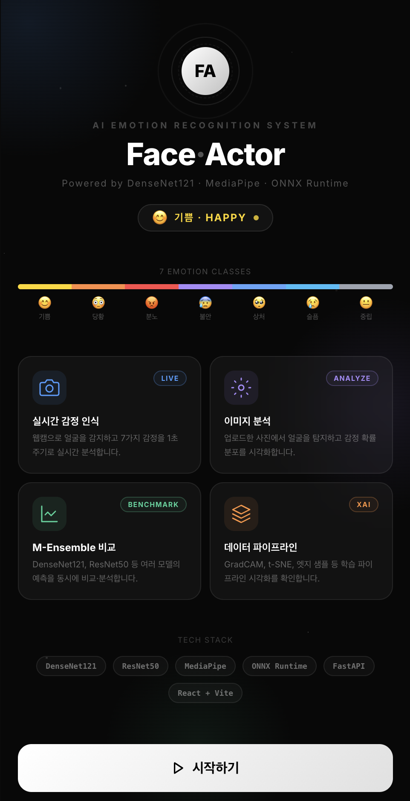
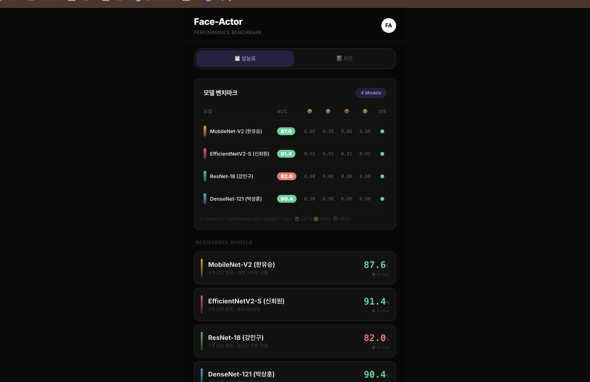
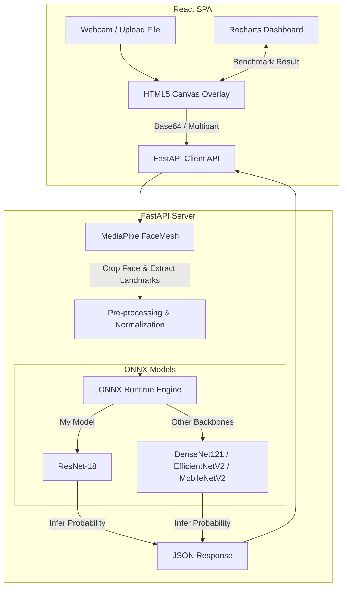

# 🎭 Face-Actor

  <h2>Face-Actor (AI 얼굴 감정 인식 및 벤치마크 시스템)</h2>
  
<strong>Face-Actor</strong>는 대규모 한국인 얼굴 감정 데이터셋을 기반으로 실시간 감정 인식 및 여러 딥러닝 모델의 성능을 비교 분석할 수 있는 풀스택 AI 웹 애플리케이션입니다.

---

## 📸 프로젝트 미리보기 (Preview)

  
  

### 🎬 데모 영상

- [데모 영상 1](./assets/demo-1.mov)
- [데모 영상 2](./assets/demo-2.mov)
- [데모 영상 3](./assets/demo-3.mov)

## 👥 팀 구성 및 모델 라인업 (Team Registry)

본 프로젝트는 **협업을 통해 개발된 이종 딥러닝 모델들**을 단일 웹 플랫폼으로 통합하여 벤치마킹할 수 있도록 구현되었습니다.

| 이름 | 담당 역할 | 개발 모델 | 모델 특징 |
|------|-----------|-----------|-----------|
| **강민구 (본인)** | **프론트엔드 & 백엔드 설계/구현 전체**   **AI 모델링 및 ONNX 서빙 최적화** | **ResNet-18** | 7개 감정 분류, 실시간 고속 추론 최적화 (Val Acc: 82.0%) |
| **신희원** | AI 모델링 | **EfficientNetV2-S** | 7개 감정 분류, 고정밀 타깃 모델 (Val Acc: 91.4%) |
| **박상훈** | AI 모델링 | **DenseNet-121** | 4개 감정 분류, 정밀 분석 모델 (Val Acc: 90.4%) |
| **한유승** | AI 모델링 | **MobileNet-V2** | 4개 감정 분류, 초경량 모바일 최적화 모델 (Val Acc: 87.6%) |

---

## 🌟 주요 기능 (기여도: 상: ⭐/ 중: ★/ 하: ☆)

*모든 기능의 프론트엔드(React), 백엔드(FastAPI) 및 ResNet-18 AI 모델 학습/ONNX 변환을 직접 개발하였습니다.*

###  ✅ 개발 완료
| 기능명 | 설명 | 기여도 |
|--------|------|--------|
| **실시간 감정 인식 & 시각화** | 웹캠 영상을 실시간 캡처하여 MediaPipe로 얼굴 랜드마크를 추출하고 7가지 감정을 실시간 오버레이로 표현 | 상 ⭐ |
| **정적 이미지 감정 분석** | 업로드된 사진에서 얼굴 영역을 자동 크롭하고 슬라이드 바 형태로 감정 확률 분석 결과 제공 | 상 ⭐ |
| **M-Ensemble 모델 벤치마크** | ResNet-18, DenseNet-121 등 여러 모델의 검증 지표를 테이블/차트로 비교하고, 단일 이미지에 대한 모델별 예측값을 앙상블 형태로 비교 분석 | 하 ☆ |
| **시작 페이지 (Start Page)** | 화려한 입자(Particles) 효과, 실시간 감정 롤링 Ticker, 주요 기능 요약 카드를 포함한 첫 진입 화면 구축 | 상 ⭐ |
| **데이터 파이프라인 시각화** | 이미지 전처리(Canny Edge, CLAHE) 단계 소개 및 Grad-CAM(XAI 히트맵), t-SNE 분포 등의 시각화 결과 제공 | 상 ⭐ |

### ⏳ 개발 예정
| 기능명 | 설명 |
|--------|------|
| **실시간 감정 통계 누적** | 웹캠 분석 세션 동안 감지된 감정의 시계열 변화 및 통계 리포트 제공 |
| **분석 결과 내보내기** | 이미지 및 벤치마크 분석 보고서를 PDF 또는 이미지 파일로 다운로드하는 기능 |
| **모바일 UI 최적화** | 반응형 모바일 화면에서 내장 카메라 연동 및 터치 제스처 성능 최적화 |

---

## 🛠 사용 기술 스택

### - 🎨 Frontend
     

### - 🔧 Backend
    

### - 🧠 AI / Deep Learning
  

### - ☁️ 실행 환경 (Infra) & 배포 (Deployment)
  

---

## 🏗️ 시스템 아키텍처 (System Architecture)

---

## 주요 화면 설명

### 1. 시작 페이지 (Start Page)

  

* **화려한 인터랙티브 첫 화면** 
  - 뒷배경에 부드럽게 움직이는 입자(Particles) 효과와 그라디언트 글로우 라이팅을 구현하여 세련된 첫인상을 남깁니다. 
  - 상단에는 7가지 감정을 순환하며 표시하는 롤링 뱃지(Emotion Ticker)와 감정 무지개 바를 배치해 서비스 주제를 직관적으로 전달합니다. 
  - 실시간 분석, 이미지 분석, 비교 벤치마크, 데이터 파이프라인의 4대 핵심 기능을 카드로 한눈에 요약하고 "시작하기"를 누르면 메인 대시보드로 이동합니다.  

### 2. 실시간 감정 인식 페이지 (Realtime Tab)
* **웹캠 기반 실시간 페이스 트래킹** 
  - HTML5 Canvas를 활용하여 웹캠 영상 위에 실시간으로 얼굴 인식 가이드 사각형과 23개의 핵심 Landmark 포인트를 60FPS 수준으로 정교하게 매핑하여 시각화합니다. 
  - 백엔드에 1초 단위로 프레임을 전송해 저지연(Low-latency) 분석을 수행하며, 7대 감정 확률 분포를 실시간 애니메이션 바 형태로 제공합니다.  

### 3. 이미지 분석 페이지 (Analyze Tab)
* **정적 이미지 분석 및 모델 선택** 
  - 사용자가 이미지를 드래그 앤 드롭하거나 선택하여 업로드하면, 백엔드에서 얼굴 감지 및 크롭을 수행해 크롭된 검출 영역(Detected Region)을 보여줍니다. 
  - 단일 모델 분석 시 사용자가 직접 원하는 백본 모델을 선택하여 분석 결과를 받아볼 수 있으며, 여러 모델의 감정 분포를 차트로 직관적이게 분석합니다.  

### 4. M-Ensemble 모델 벤치마크 페이지 (Model Compare Tab)

  

* **여러 딥러닝 모델의 객관적 성능 비교** 
  - 개발 완료된 이종 모델(ResNet-18, DenseNet-121, EfficientNetV2-S, MobileNet-V2)의 전체 정확도(Accuracy) 및 감정별 F1-Score 지표를 정갈한 테이블(성능표) 형식으로 정리하여 비교 분석합니다. 
  - Recharts 라이브러리를 통해 전체 정확도 및 클래스별 F1-Score를 동적 그래프로 비교 시각화하여 어떤 모델이 실시간성 및 신뢰도에 적합한지 벤치마킹할 수 있습니다.  

### 5. 데이터 파이프라인 및 시각화 페이지 (Pipeline Tab)
* **데이터 흐름 및 XAI(설명 가능한 AI) 시각화** 
  - AI Hub 데이터 가공부터 크롭, CLAHE 평활화, Canny 엣지 추출, 증강 및 추론까지의 학습 파이프라인을 체계적으로 설명합니다. 
  - Canny Edge 시각화 데이터, 신경망이 판단의 근거로 삼은 영역을 열지도로 보여주는 **Grad-CAM 히트맵**, 고차원 피처 공간의 클러스터링을 보여주는 **t-SNE** 분포 시각화 결과를 제공해 딥러닝 모델의 판단 근거를 직관적으로 파악할 수 있도록 돕습니다.  

---

## 💡 프로젝트 핵심 인사이트 & 배운 점 (Junior Developer View)

* **실제 서비스 관점의 모델 서빙 (ONNX Runtime CPU 최적화)**:
  PyTorch 모델(`.pth`)을 그대로 사용하지 않고 **ONNX 포맷으로 변환 및 직렬화**하여 서빙 엔진의 딥러닝 프레임워크 의존성을 제거했습니다. 이를 통해 GPU가 없는 CPU 인프라 환경(**Render**)에서도 단일 모델 기준 **평균 10ms 이내의 실시간 추론 속도**를 달성하며 실무에서 중요시하는 성능 및 인프라 비용 절감에 대한 감각을 길렀습니다.
* **MediaPipe FaceMesh 기반 경량 데이터 전처리**:
  대용량 이미지를 통째로 신경망에 통과시키는 비효율을 방지하고자 백엔드 초입에 **MediaPipe**를 연계해 고속으로 얼굴 영역만을 Bounding Box로 탐지하고 정규화 크롭한 뒤, 가벼운 랜드마크 데이터 세트와 함께 활용하는 경량 전처리 파이프라인을 구축하여 처리 속도를 최적화했습니다.
* **이종 모델 앙상블 분석 프레임워크 구축**:
  다양한 백본 모델들을 직접 학습시키고, 웹 프론트엔드상에 이들의 성능과 실시간 분석 결과를 대조해볼 수 있는 차트 시스템을 손수 설계함으로써, 머신러닝 결과물을 단순 수치로만 보는 것이 아니라 **웹 서비스 환경에서 시각적으로 검증하고 제어하는 실무적 풀스택 개발 역량**을 함양했습니다.
* **클라우드 환경 기반의 무중단 배포 경험 (Vercel & Render)**:
  프론트엔드는 **Vercel** 플랫폼을 이용하여 React 빌드 결과물을 전 세계 CDN 에지로 호스팅하고 SSL 보안 연결 및 캐싱 성능을 확보했습니다. 백엔드는 **Render**에서 제공하는 Docker 컨테이너 배포 환경을 통해 FastAPI 서버의 지속적인 클라우드 실행 및 로드 관리를 실전처럼 운영해 보았습니다.
