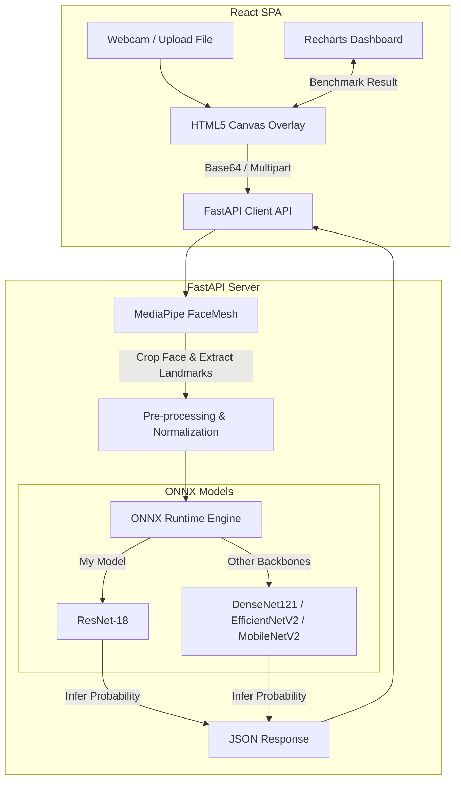

# 🎭 Face-Actor: 실시간 AI 얼굴 감정 인식 및 벤치마크 시스템

> **대규모 한국인 얼굴 감정 데이터셋을 기반으로 모델 학습부터 경량화 추론, 그리고 실시간 웹 인터페이스까지 전 과정을 설계·구현한 풀스택 AI 웹 애플리케이션 포트폴리오입니다.**

---

## 🛠️ 기여 부분 및 역할 (My Contributions)

본 프로젝트에서 **프론트엔드 및 백엔드 개발 전체**와, 실시간 고속 추론을 위한 **ResNet-18 감정 인식 모델의 학습 및 ONNX 경량화 변환** 프로세스를 전담하여 개발하였습니다.

*   **AI 모델링 & 경량화 (ResNet-18)**
    *   AI Hub의 한국인 감정인식 이미지 데이터를 학습하여 실시간 추론에 최적화된 **ResNet-18** 감정 분류 모델 설계.
    *   CPU 환경에서의 저지연(Low-latency) 웹 서비스를 위해 PyTorch 모델을 **ONNX 포맷으로 변환 및 최적화**하여 **단일 추론 속도 10ms 이하(sub-10ms)** 달성.
*   **백엔드 개발 (FastAPI + ONNX Runtime)**
    *   Python 기반의 고성능 비동기 웹 프레임워크인 **FastAPI**를 사용하여 REST API 서버 구축.
    *   **MediaPipe FaceMesh**를 통합하여 실시간 웹캠 피드에서 신속하고 정확하게 얼굴 영역(Bounding Box)을 감지하고 24개의 핵심 얼굴 랜드마크 좌표를 추출하는 전처리 파이프라인 구현.
    *   서버 리소스 최소화를 위해 **ONNX Runtime** 엔진을 탑재하여 멀티모델(이종 백본 모델 4개) 동시 추론 최적화.
*   **프론트엔드 개발 (React + Vite)**
    *   **Vite + React** 기반의 고속 Single Page Application(SPA) 아키텍처 설계.
    *   HTML5 Canvas를 활용하여 웹캠 영상 위에 실시간으로 얼굴 인식 영역 가이드라인 및 FaceMesh 랜드마크를 **60FPS 수준으로 실시간 렌더링(Overlay)**.
    *   **Recharts** 라이브러리를 활용하여 각 딥러닝 모델의 성능 지표와 이미지 분석 시 모델별 감정 예측 확률 분포를 시각적으로 직관적이게 비교해 주는 벤치마크 대시보드 구현.
    *   세련된 다크 테마 기반의 **유리 모티프(Glassmorphism) UI** 및 반응형 레이아웃 설계.

---

## 🌟 핵심 기능 (Key Features)

1.  **실시간 감정 분석 (Live Webcam Detection)**
    *   사용자의 웹캠 비디오 스트림을 실시간 프레임 단위로 백엔드에 송신.
    *   얼굴 감지 영역 및 23개 주요 Landmark Point를 실시간 오버레이로 표시하며 7가지 감정(기쁨, 당황, 분노, 불안, 상처, 슬픔, 중립)의 변화를 실시간 분석 및 차트 시각화.
2.  **정적 이미지 감정 분석 (Static Image Analysis)**
    *   사용자가 업로드한 사진에서 얼굴 영역을 자동으로 검출하고, 해당 얼굴의 미세 표정을 기반으로 7대 감정 확률 분포를 정밀 분석.
3.  **이종 모델 비교 벤치마크 (M-Ensemble Benchmark)**
    *   학습된 4가지 모델(ResNet-18, MobileNet-V2, EfficientNetV2-S, DenseNet-121)의 검증 성능표(Accuracy, F1-Score)와 차트 비교 기능 제공.
    *   단일 이미지 업로드 시, 모든 모델이 동시에 추론을 진행하여 각 모델의 예측 감정과 추론 시간(ms)을 비교할 수 있는 앙상블 분석 모드 제공.
4.  **데이터 파이프라인 시각화 (XAI & Preprocessing Pipeline)**
    *   전처리 단계(Canny Edge Extraction, CLAHE 조도 평활화)의 가시적 변화 분석 제공.
    *   설명 가능한 AI(XAI) 기술인 **Grad-CAM** 히트맵(모델이 이미지의 어떤 영역을 보고 감정을 판단했는지 분석) 및 **t-SNE** 고차원 피처 투영 차트 등 AI 학습 과정을 단계적으로 시각화하여 정보 전달.

---

## 🏗️ 시스템 아키텍처 및 추론 파이프라인



---

## 💻 기술 스택 (Tech Stack)

### **AI / Deep Learning**
*   **PyTorch**: 모델 설계, 학습, 평가 및 체크포인트(`.pth`) 관리.
*   **ONNX (Open Neural Network Exchange)**: 크로스 플랫폼 초고속 CPU 추론을 위한 모델 경량화 및 직렬화.

### **Backend**
*   **FastAPI**: 비동기 엔드포인트 처리를 통한 실시간 프레임 전송 최적화.
*   **ONNX Runtime (CPU)**: 딥러닝 프레임워크 의존성을 제거하고 추론 성능 극대화 (평균 10ms 이내 처리).
*   **MediaPipe / OpenCV**: 얼굴 랜드마크 추출 및 이미지 크롭, 전처리(CLAHE, Canny Edge) 수행.

### **Frontend**
*   **React (v18) + Vite**: 컴포넌트 기반 구조, 효율적인 상태 관리 및 초고속 번들러 활용.
*   **Recharts**: 모델 성능 지표 및 추론 결과 확률 시각화.
*   **Tailwind CSS & CSS**: 반응형 레이아웃 구성 및 세련된 Glassmorphism 테마 애니메이션 구현.

---

## 📊 모델 학습 및 성능 분석 (My Model: ResNet-18)

*   **데이터셋**: AI Hub 한국인 감정인식 이미지 데이터 (약 48만 장 중 균형 샘플링)
*   **클래스 (7개)**: 기쁨, 당황, 분노, 불안, 상처, 슬픔, 중립
*   **학습 설정 (Hyperparameters)**:
    *   **Loss Function**: Focal Loss ($\gamma = 2.0$) 적용을 통해 클래스 불균형 및 어려운 샘플 학습 보완
    *   **Optimizer**: AdamW (Learning Rate: 1e-4, Weight Decay: 1e-4)
    *   **Learning Rate Scheduler**: Cosine Annealing LR 적용으로 안정적인 수렴 도모
    *   **Epochs / Batch Size**: 30 Epochs / Batch Size 64
*   **검증 결과 (Validation Accuracy)**: **82.0%** 달성 (실시간 고속 추론 성능 확보)

---

## 🚀 실행 방법 (Getting Started)

### **Prerequisites**
*   Node.js (v18 이상 권장)
*   Python (3.9 이상 권장)

### **Backend 실행**
1. 백엔드 디렉토리로 이동하여 의존성 패키지를 설치합니다.
   ```bash
   cd server
   pip install -r requirements.txt
   ```
2. FastAPI 서버를 기동합니다. (기본 포트: 8000)
   ```bash
   python -m uvicorn server.main:app --host 0.0.0.0 --port 8000 --reload
   ```

### **Frontend 실행**
1. 프론트엔드 디렉토리로 이동하여 의존성 패키지를 설치합니다.
   ```bash
   cd frontend
   npm install
   ```
2. 개발 서버를 실행합니다.
   ```bash
   npm run dev
   ```
3. 브라우저에서 `http://localhost:5173`으로 접속합니다.

---

## 💡 프로젝트 핵심 인사이트 & 배운 점 (Junior Developer View)

*   **실제 서비스 관점의 모델 서빙(ONNX Runtime)**: 
    PyTorch 학습 모델(`.pth`)을 서버에 그대로 서빙하는 대신, **ONNX 포맷으로 변환하여 의존성을 줄이고 ONNX Runtime CPU 추론을 도입**함으로써 GPU가 없는 일반 서버 환경에서도 단일 모델 추론 속도를 **10ms 미만**으로 비약적으로 단축시켰습니다. 이를 통해 서비스 상용화에 중요한 '비용 효율성'과 '실시간성'을 모두 챙기는 기법을 터득했습니다.
*   **MediaPipe를 활용한 프론트-백 파이프라인 연계**:
    웹 프론트엔드에서 고용량 원본 이미지를 전송하는 비효율성을 극복하기 위해, 백엔드단에서 **MediaPipe FaceMesh**를 활용해 얼굴 부분만 크롭하고 핵심 랜드마크 23개만 추려 이미지 크기를 최소화하는 전처리 기프트를 결합함으로써 통신 페이로드 용량을 대폭 줄였습니다.
*   **벤치마크 기반의 객관적 성능 분석**:
    다양한 딥러닝 백본 아키텍처(ResNet, EfficientNet, DenseNet 등)를 훈련하여 단순 수치 비교를 넘어, 프론트엔드에 실시간 대시보드(Recharts)와 모델별 추론 속도 비교 기능을 설계하여 **어떤 모델이 실시간 환경에 가장 적합한지 객관적으로 검증할 수 있는 비교 프레임워크**를 손수 구축했습니다.
